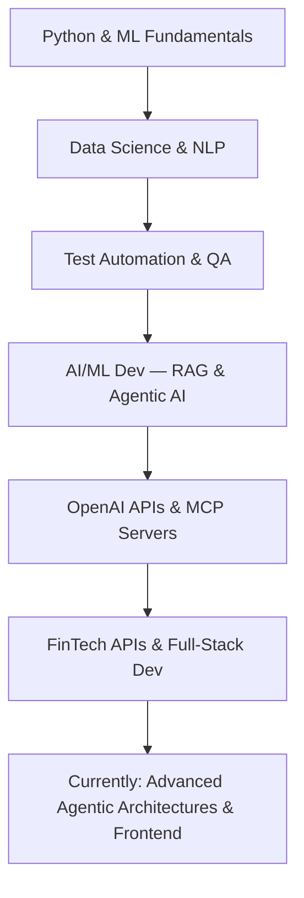

#  Hi there, I'm Ishan Chakraborty

<div align="center">
  
</div>

<div align="center">
  

  
</div>

---

<div align="center">

  📧 ishanchakraborty2496@gmail.com | 📱 +91 7021133070 | 📍 Kolkata, West Bengal

  [](https://linkedin.com/in/ishan-chakraborty)
  [](https://github.com/Ishan96Dev)
  [](https://ishan96dev.github.io)

</div>

---

## 💼 Professional Summary

**AI/ML Developer, Python Backend Engineer, and Frontend Developer** with **3+ years of experience** building production-grade AI applications, real-time FinTech APIs, RAG systems, Agentic AI workflows, and modern web interfaces. Passionate about **OpenAI GPT-4/GPT-5 integration**, **MCP server development**, **Next.js/React frontends**, and **real-time financial data systems**.

Proven track record delivering **Python REST APIs** for SEBI-regulated exchanges, building **multi-agent RAG systems** with CrewAI and Milvus, developing **AI-powered full-stack apps** (React + FastAPI + Supabase + GPT-4), and creating **MCP servers** for AI developer tooling. Strong QA foundation ensures every system ships with reliability, automated testing, and production-ready quality.

### 🎯 Key Highlights

- 🤖 **AI/ML Developer** — RAG systems, Agentic AI, OpenAI GPT-4/5 integration, MCP server development
- 🐍 **Python Backend Engineer** — FastAPI/Flask REST APIs, FinTech data pipelines, real-time financial systems
- ⚛️ **Frontend Developer** — Next.js, React.js, TypeScript, HTML5/CSS3 animations, Streamlit dashboards
- 💹 **FinTech Specialist** — Real-time stock market APIs for SEBI-regulated exchanges (MSEI)
- 🔬 **Data Scientist** — ML models, NLP, computer vision, Streamlit analytics apps
- 🧪 **QA & AI Testing** — Robot Framework, Selenium, Playwright, LLM/RAG/Agentic AI testing

---

## 🛠️ Technical Skills

### 🤖 AI / ML Technologies
<div align="center">
  
  
  
  
  
  
  
  
</div>

### 🌐 Frontend Development
<div align="center">
  
  
  
  
  
  
</div>

### 🐍 Python Backend Development
<div align="center">
  
  
  
  
  
</div>

### 🗄️ Database & Analytics
<div align="center">
  
  
  
  
  
  
</div>

### 🐳 DevOps & Containerization
<div align="center">
  
  
  
  
  
</div>

### 🧪 QA & Testing (Supporting Expertise)
<div align="center">
  
  
  
  
  
  
  
</div>

### 💻 Other Languages
<div align="center">
  
  
  
</div>

---

## 📈 GitHub Stats

<div align="center">
  <table>
    <tr>
      <td align="center">
        
      </td>
      <td align="center">
        
      </td>
    </tr>
    <tr>
      <td align="center" colspan="2">
        
      </td>
    </tr>
  </table>
</div>

<div align="center">
  
</div>

---

## 📊 GitHub Analytics

<div align="center">
  
</div>

<div align="center">
  
</div>

<div align="center">
  <table>
    <tr>
      <td>
        
      </td>
      <td>
        
      </td>
    </tr>
  </table>
</div>

---

## 💼 Professional Experience

### 🌐 Freelance Python Backend Developer | Metropolitan Stock Exchange of India (MSEI)
**April 2026** | Remote

- 🐍 **Python REST API Development**: Architected Python backend service with REST API delivering real-time stock market ticker data (SX40 Index, USDINR/EURINR/GBPINR/JPYINR forex rates) as structured JSON for SEBI-regulated national exchange
- ⚛️ **Next.js Integration**: Integrated RESTful API with client's Next.js website for live market data visualization and dynamic ticker display across the trading platform
- 🎨 **HTML5/CSS3 Animated Ticker UI**: Developed animated Ticker UI with LED display board compatibility for physical market data screens, ensuring cross-platform rendering for web browsers and LED hardware outputs
- 💹 **FinTech & Financial Data Systems**: Engineered real-time financial data pipelines for equity, currency derivatives, debt, and ETF segment data from SEBI-regulated exchange infrastructure
- 📄 **API Documentation**: Delivered comprehensive REST API documentation and system integration guides enabling seamless third-party integrations

### 🚀 QA Engineer | Katonic.ai
**January 2024 – December 2025** | Remote

- ✅ **Automation Framework**: Executed comprehensive automation testing using **Robot Framework** with **Docker** containerization for scalable test execution across multiple VM/Container environments
- 🔄 **CI/CD Integration**: Developed custom mailing system for automated test report delivery in **GitHub CI/CD pipelines** using Robot Framework, HTML, and Python
- 🌐 **Cross-Browser Testing**: Developed and maintained automated test suites using **Selenium WebDriver** and **Playwright** for comprehensive UI automation
- 🔌 **API Testing**: Performed extensive API testing using **Postman**, validating REST endpoints, request/response payloads, and authentication workflows
- ⚡ **Performance Testing**: Conducted load and performance testing using **Locust** and **Apache JMeter** to evaluate system scalability and identify bottlenecks
- 🤖 **LLM Testing**: Executed specialized testing of **Large Language Models** and **Generative AI systems** to ensure accuracy, reliability, and response quality
- 📚 **RAG Systems**: Validated **RAG (Retrieval-Augmented Generation)** system performance, testing document retrieval accuracy and contextual response generation
- 🎯 **Agentic AI**: Tested **Agentic AI workflows**, ensuring proper task execution, decision-making logic, and multi-agent coordination
- 🐛 **Defect Tracking**: Logged, tracked, and managed defects using **GitHub Issues** and **Jira**
- 🗄️ **Database Testing**: Performed database testing and SQL query validation to ensure data integrity

### 📊 Data Scientist | Katonic.ai
**September 2021 – January 2024** | Remote

- 🏦 **Predictive Analytics**: Led bank churn prediction project for **PNC Bank** using machine learning models
- 🚀 **Marketplace Apps**: Developed and deployed production apps for **Katonic Marketplace** using **Streamlit**
- 💬 **NLP Applications**: Built **Sentiment Analyzer** using NLP for text classification (positive/negative/neutral)
- 😷 **Computer Vision**: Built **Mask Detection** application using Python, OpenCV, and deep learning
- 🤖 **Generative AI Chatbots**: Developed AI chatbots using industry-specific banking and financial data
- 📈 **Data Visualization**: Created interactive dashboards using **Plotly** for complex data analysis

### 🔒 Test Engineer Intern | Sectona
**January 2020 – March 2020** | Mumbai

- 🛡️ **Security Testing**: Tested security-related user interfaces for enterprise security software
- 💻 **Cross-Platform**: Integrated and tested UI compatibility across **Linux** and **Windows** environments
- 📝 **Manual Testing**: Performed manual testing and documented test cases for security features

---

## 🚀 Projects & Repositories

<div align="center">

### 🤖 AI / ML Development

<table>
  <tr>
    <td width="50%" valign="top">
      <h3 align="center">🤖 MCP OpenAI Image Generator</h3>
      <div align="center">
        <a href="https://github.com/Ishan96Dev/mcp-openai-image-generator" target="_blank">
          
        </a>
        <p><strong>Python MCP server integrating OpenAI image generation APIs</strong></p>
        <p>Integrates with Claude, Cursor, VS Code, and GitHub Copilot. Features rate limiting, error handling, and Render deployment.</p>
        <p>
          
          
          
        </p>
      </div>
    </td>
    <td width="50%" valign="top">
      <h3 align="center">🤖 Document Knowledge Retrieval (RAG)</h3>
      <div align="center">
        <a href="https://github.com/Ishan96Dev/document-knowledge-retrieval" target="_blank">
          
        </a>
        <p><strong>Multi-agent RAG system powered by CrewAI, Milvus, and OpenAI</strong></p>
        <p>Upload documents and ask questions in natural language — AI agents retrieve and synthesize comprehensive answers.</p>
        <p>
          
          
          
          
        </p>
      </div>
    </td>
  </tr>
  <tr>
    <td width="50%" valign="top">
      <h3 align="center">🔗 HeliosConnect — LinkedIn AI Agent</h3>
      <div align="center">
        <a href="https://github.com/Ishan96Dev/heliosconnect" target="_blank">
          
        </a>
        <p><strong>AI-powered LinkedIn automation agent with semantic scoring</strong></p>
        <p>Semantic prospect scoring, GPT-4 message generation, and rate-aware connection automation for personalized outreach.</p>
        <p>
          
          
        </p>
      </div>
    </td>
    <td width="50%" valign="top">
      <h3 align="center">🧠 AI Sentiment Analyzer — GPT-4/5</h3>
      <div align="center">
        <a href="https://github.com/Ishan96Dev/ai-sentiment-analyzer" target="_blank">
          
        </a>
        <p><strong>Advanced GPT-5/GPT-4 sentiment analysis with reasoning transparency</strong></p>
        <p>4-type classification, confidence metrics, real-time validation, and professional Streamlit UI for enterprise-grade analysis.</p>
        <p>
          
          
          
        </p>
      </div>
    </td>
  </tr>
</table>

---

### 🐍 Python Backend & FinTech

<table>
  <tr>
    <td width="50%" valign="top">
      <h3 align="center">💰 YesBill — AI-Powered Billing Tracker</h3>
      <div align="center">
        <a href="https://github.com/Ishan96Dev/YesBill" target="_blank">
          
        </a>
        <a href="https://yesbill.vercel.app/" target="_blank">
          
        </a>
        <p><strong>Full-stack AI billing management app with GPT-4</strong></p>
        <p>React + FastAPI + Supabase + GPT-4: AI-powered daily billing, YES/NO delivery marking, PDF invoice export, AI spending summaries.</p>
        <p>
          
          
          
          
        </p>
      </div>
    </td>
    <td width="50%" valign="top">
      <h3 align="center">📊 EA Stock Streamlit Dashboard</h3>
      <div align="center">
        <a href="https://github.com/Ishan96Dev/ea-stock-dashboard" target="_blank">
          
        </a>
        <p><strong>Interactive stock analytics dashboard with user behavior analysis</strong></p>
        <p>EA stock data (price, dividends, splits) with dynamic charts, filters, and historical performance insights.</p>
        <p>
          
          
          
        </p>
      </div>
    </td>
  </tr>
  <tr>
    <td width="50%" valign="top">
      <h3 align="center">🔍 SentimentScope — NLP Analysis</h3>
      <div align="center">
        <a href="https://github.com/Ishan96Dev/sentimentscope" target="_blank">
          
        </a>
        <p><strong>Real-time NLP sentiment analysis with TextBlob</strong></p>
        <p>Emotion detection with confidence scoring and visual classification metrics — positive, negative, neutral.</p>
        <p>
          
          
          
        </p>
      </div>
    </td>
    <td width="50%" valign="top">
      <h3 align="center">🎨 Digital Portfolio App</h3>
      <div align="center">
        <a href="https://github.com/Ishan96Dev/digital-portfolio-app" target="_blank">
          
        </a>
        <p><strong>Modern interactive portfolio with dual themes & AI/ML effects</strong></p>
        <p>Comprehensive Streamlit app showcasing professional profiles, skills, and achievements with modern CSS animations.</p>
        <p>
          
          
        </p>
      </div>
    </td>
  </tr>
</table>

---

### ⚛️ Frontend & Full-Stack Web

<table>
  <tr>
    <td width="50%" valign="top">
      <h3 align="center">📄 DocForge — Web-to-PDF Converter</h3>
      <div align="center">
        <a href="https://github.com/Ishan96Dev/docforge" target="_blank">
          
        </a>
        <p><strong>TypeScript + React + FastAPI intelligent web crawler & PDF generator</strong></p>
        <p>Smart sitemap detection converts live documentation into structured PDFs with intelligent batch page discovery.</p>
        <p>
          
          
          
        </p>
      </div>
    </td>
    <td width="50%" valign="top">
      <h3 align="center">🌐 Ishan Portfolio — Developer Portfolio</h3>
      <div align="center">
        <a href="https://github.com/Ishan96Dev/ishan-portfolio" target="_blank">
          
        </a>
        <p><strong>Official developer portfolio deployed on Vercel</strong></p>
        <p>Showcasing AI, Automation, and Web Development projects. Responsive design with modern UI/UX patterns.</p>
        <p>
          
          
        </p>
      </div>
    </td>
  </tr>
</table>

---

### 🧪 QA / Automation & ML

<table>
  <tr>
    <td width="50%" valign="top">
      <h3 align="center">🤖 Robot Framework GitHub Action</h3>
      <div align="center">
        <a href="https://github.com/Ishan96Dev/robotframework-github-action" target="_blank">
          
        </a>
        <p><strong>GitHub Action for Docker-based Robot Framework CI/CD testing</strong></p>
        <p>Automated CI/CD testing workflows using ppodgorsek/robot-framework Docker image for continuous integration pipelines.</p>
        <p>
          
          
          
        </p>
      </div>
    </td>
    <td width="50%" valign="top">
      <h3 align="center">🧠 Machine Learning Projects</h3>
      <div align="center">
        <a href="https://github.com/Ishan96Dev/ML-Projects" target="_blank">
          
        </a>
        <p><strong>NLP & Computer Vision ML Applications</strong></p>
        <p><strong>Sentiment Analyzer</strong>: TextBlob NLP for social data sentiment classification.</p>
        <p><strong>Face Mask Detector</strong>: COVID-19 safety compliance using Python, OpenCV & TensorFlow.</p>
        <p>
          
          
          
        </p>
      </div>
    </td>
  </tr>
</table>

</div>

---

## 🌟 What I Bring to the Table

```yaml
AI_Development:    "RAG systems, Agentic AI, MCP servers, OpenAI GPT-4/5 integration"
Python_Backend:    "FastAPI/Flask REST APIs, real-time FinTech data pipelines"
Frontend:          "Next.js, React, TypeScript — responsive, animated modern UIs"
Architecture:      "Clean, scalable, and maintainable full-stack code structures"
Problem_Solving:   "Turning complex AI/data challenges into elegant production apps"
QA_Foundation:     "Every project ships with reliability, automation, and tested quality"
```

---

## 📈 Learning Journey

<div align="center">



</div>

---

## 🎓 Education & Certifications

### 🎓 Education

**Bachelor of Engineering (Electronics & Communication)**  
RKDF University, Bhopal | 2019  
*College Internship: ZCODE TECHNOLOGY — C++, Java, Python, and IC Programming*

**Higher Secondary Certificate**  
Lords Universal Junior College, Mumbai | 2015  
*Specialization: Electronics 1 and Electronics 2*

**ICSE Secondary Education**  
Prime Academy ICSE & International, Mumbai | 2012  
*Specialization: Technical Drawing Application*

### 🏅 Certifications

<div align="center">

| Certificate | Provider | Category |
|------------|----------|----------|
| 🐍 **Python Programming** | Udemy | Programming |
| 🐳 **Docker & Containerization** | Udemy | DevOps |
| 📊 **Google Analytics (Basic & Advanced)** | Google | Analytics |

</div>

---

## 🎮 YouTube Gaming Channel

<div align="center">

  ### 🎬 IshanGaming96

  

  **12,303 Subscribers** | **1.1K+ Views** | **7.9 Hours Watch Time**

  🎮 Creating engaging gaming content featuring gameplay walkthroughs, battles, and exciting moments!

  [](https://youtube.com/@ishangaming96)

  > *Passionate about sharing gaming experiences and building a community of gamers!*

</div>

---

## 🎯 Interests & Activities

<div align="center">

⚽ **Football** | ♟️ **Chess** | 🎮 **Game Development (Unity & C#)** | 🔬 **Testing Emerging Technologies**  
📸 **Photography** | 🎯 **Video Gaming** | 🎬 **Video Editing** | 🍳 **Cooking**

</div>

---

## 🤝 Let's Connect & Collaborate

<div align="center">

*"The best way to predict the future is to create it."*

I'm always excited to connect with fellow developers and innovators. Whether you're looking to collaborate on AI/ML projects, build FinTech systems, discuss emerging technologies, or just chat about code — I'd love to hear from you!

[](https://linkedin.com/in/ishan-chakraborty)
[](mailto:ishanchakraborty2496@gmail.com)
[](https://github.com/Ishan96Dev)
[](tel:+917021133070)

📍 **Location**: Kolkata, West Bengal – 700078, India | 🎂 **DOB**: 24th May 1996

</div>

---

<div align="center">

  ### 💡 "Building intelligent systems that matter." 🚀

  

  ⭐ **If you find my work interesting, consider starring my repositories!** ⭐

  

</div>
